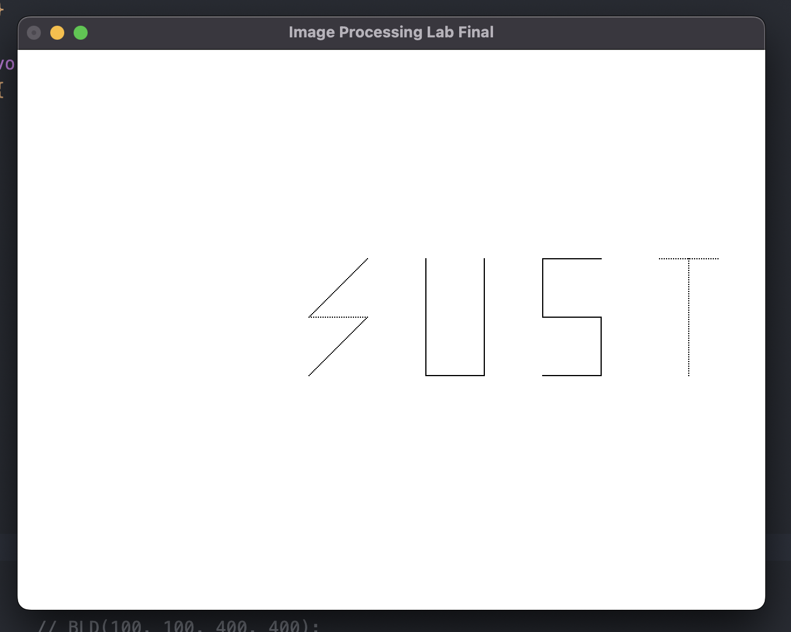
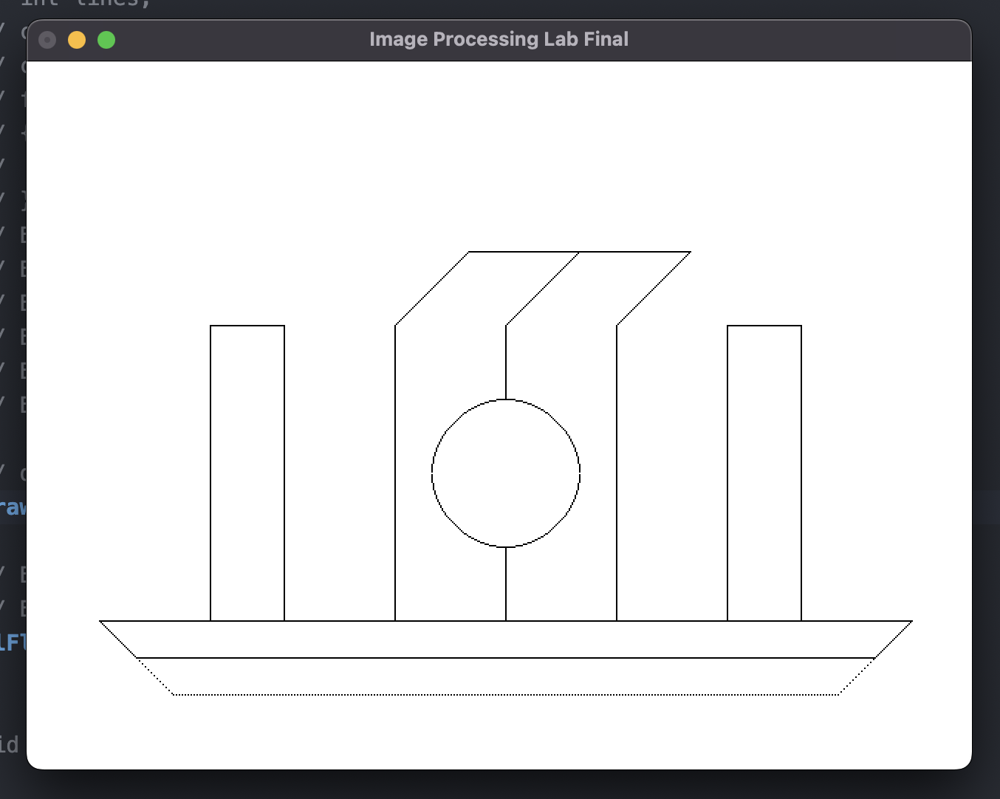

# Basic Image Processing

## Algorithms

### Line Drawing

- [DDA](./line/dda.cpp)
- [Bresenhum](./line/bresenhum.cpp)
### Circle Drawing

- [Mid Point Algorithm](./circle/mid_point.cpp)
- [Bresenham Algorithm](./circle/bresenhum.cpp)

## Lab Final

## Stack

- Language : C++
- Library : OPEN GL, GLUT

## How To Setup

### MAC 
Opengl and glut comes by default with mac os, So you need nothing do setup for this.

### Windows

- [Glut Setup for CodeBlocks 20.03 | Setting up Codeblocks 20.03 with Freeglut for Windows](https://www.youtube.com/watch?v=7rLo69vCooU&ab_channel=AIUBSOLUTION)

## How To Run 

### On MacBook

#### CLI

- `g++ -w  filename.cpp -o test -framework GLUT -framework OpenGL && ./test`

#### VS Code

- `⇧+⌘+b`
